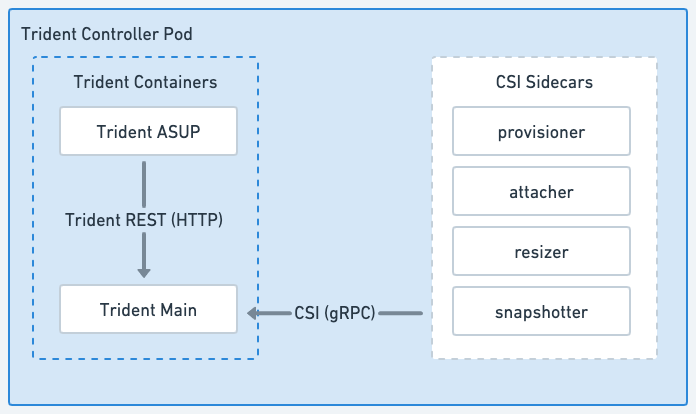

= Arquitetura do Trident
:hardbreaks:
:allow-uri-read: 
:icons: font
:imagesdir: ../media/

[role="lead"]
Trident é executado como um único Controller Pod mais um Node Pod em cada nó de trabalho do cluster. O Node Pod deve estar em execução em qualquer host onde você deseja montar um volume Trident.

== Entendendo os pods do controlador e os pods do nó

Trident é implantado como um único <<Pod do Trident Controller>> e um ou mais <<Pods de nó do Trident>> no cluster Kubernetes e usa os contêineres sidecar CSI padrão do Kubernetes para simplificar a implantação dos plugins CSI. link:https://kubernetes-csi.github.io/docs/sidecar-containers.html["Contêineres Sidecar CSI do Kubernetes"^] são mantidos pela comunidade de armazenamento do Kubernetes.

Kubernetes link:https://kubernetes.io/docs/concepts/scheduling-eviction/assign-pod-node/["seletores de nós"^] e link:https://kubernetes.io/docs/concepts/scheduling-eviction/taint-and-toleration/["tolerations e taints"^] são usados para restringir um pod a ser executado em um nó específico ou preferencial. Você pode configurar seletores de nós e tolerâncias para pods de controlador e de nó durante a instalação do Trident.

* O plugin do controlador lida com o provisionamento e gerenciamento de volumes, como snapshots e redimensionamento.
* O plugin do nó gerencia a conexão do storage ao nó.

.Trident implantado no cluster Kubernetes
image::../media/trident-arch.png[Diagrama da arquitetura Trident no cluster Kubernetes.]

=== Pod do Trident Controller

O Trident Controller Pod é um único Pod que executa o plugin CSI Controller.

* Responsável pelo provisionamento e gerenciamento de volumes em NetApp storage
* Gerenciado por uma implantação do Kubernetes
* Pode ser executado no plano de controle ou nos nós de trabalho, dependendo dos parâmetros de instalação.

.Diagrama do Pod do Controlador Trident

=== Pods de nó do Trident

Os Pods do Trident Node são Pods privilegiados que executam o plugin CSI Node.

* Responsável por montar e desmontar o storage para os Pods em execução no host
* Gerenciado por um Kubernetes DaemonSet
* Deve ser executado em qualquer nó que monte NetApp storage

.Diagrama do Trident Node Pod
image::../media/node-pod.png[Diagrama do Trident Node Pod executando o plugin CSI Node com o CSI sidecar aplicável.]

== Arquiteturas de cluster Kubernetes suportadas

Trident é compatível com as seguintes arquiteturas do Kubernetes:

[cols="3,1,2"]
|===
| Arquiteturas de cluster Kubernetes | Suportado | Instalação padrão 

| Mestre único, compute | Sim  a| 
Sim

| Múltiplos mestres, compute | Sim  a| 
Sim

| Mestre, `etcd`, computacional | Sim  a| 
Sim

| Mestre, infraestrutura, compute | Sim  a| 
Sim

|===