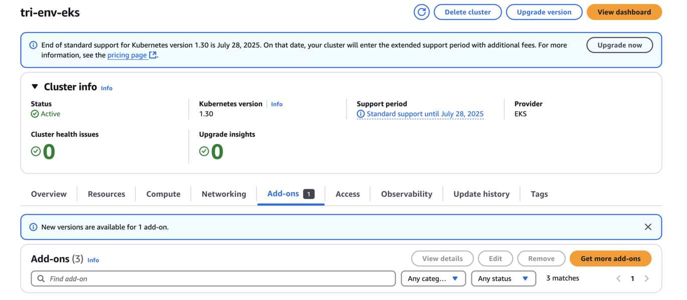

= Configurar o complemento Trident EKS em um cluster EKS
:hardbreaks:
:allow-uri-read: 
:icons: font
:imagesdir: ../media/

[role="lead"]
NetApp Trident simplifica o gerenciamento de storage do Amazon FSx for NetApp ONTAP no Kubernetes para permitir que seus desenvolvedores e administradores se concentrem na implantação de aplicativos. O NetApp Trident EKS add-on inclui os patches de segurança mais recentes, correções de bugs e é validado pela AWS para funcionar com o Amazon EKS. O EKS add-on permite garantir de forma consistente que seus clusters Amazon EKS estejam seguros e estáveis e reduz a quantidade de trabalho necessária para instalar, configurar e atualizar add-ons.

== Pré-requisitos

Certifique-se de ter o seguinte antes de configurar o add-on Trident para AWS EKS:

* Uma conta de cluster Amazon EKS com permissões para trabalhar com complementos. Consulte link:https://docs.aws.amazon.com/eks/latest/userguide/eks-add-ons.html["Complementos do Amazon EKS"^].
* Permissões da AWS para o AWS marketplace:
`"aws-marketplace:ViewSubscriptions",
"aws-marketplace:Subscribe",
"aws-marketplace:Unsubscribe`
* Tipo de AMI: Amazon Linux 2 (AL2_x86_64) ou Amazon Linux 2 Arm(AL2_ARM_64)
* Tipo de nó: AMD ou ARM
* Um sistema de arquivos Amazon FSx for NetApp ONTAP existente

== Passos

. Certifique-se de criar uma função do IAM e um segredo da AWS para permitir que os pods do EKS acessem os recursos da AWS. Para obter instruções, consulte link:../trident-use/trident-fsx-iam-role.html["Crie uma função do IAM e um segredo da AWS"^].
. No seu cluster Kubernetes EKS, navegue até a guia *Add-ons*.
+

. Acesse *AWS Marketplace add-ons* e escolha a categoria _storage_.
+
image::../media/aws-eks-02.png[aws eks 02]

. Localize *NetApp Trident* e selecione a caixa de seleção para o add-on Trident e clique em *Próximo*.
. Escolha a versão desejada do add-on.
+
image::../media/aws-eks-03.png[aws eks 03]

. Configurar as definições adicionais necessárias.
+
image::../media/aws-eks-04.png[aws eks 04]

. Se você estiver usando IRSA (IAM roles para conta de serviço), consulte as etapas de configuração adicionais link:https://docs.netapp.com/us-en/trident/trident-use/trident-fsx-install-trident.html#enable-the-trident-add-on-for-aws["aqui"].
. Selecione *Create*.
. Verifique se o status do add-on é _Ativo_.
+
image::../media/aws-eks-05.png[aws eks 05]

. Execute o seguinte comando para verificar se Trident está instalado corretamente no cluster:
+
[listing]
----
kubectl get pods -n trident
----
. Continue a configuração e configure o backend de storage. Para obter informações, consulte link:../trident-use/trident-fsx-storage-backend.html["Configurar o backend de armazenamento"^].

== Instalar/desinstalar o Trident EKS add-on usando CLI

.Instale o NetApp Trident EKS add-on usando CLI:
O seguinte comando de exemplo instala o Trident EKS add-on:
`eksctl create addon --cluster clusterName --name netapp_trident-operator --version v25.6.0-eksbuild.1` (com uma versão dedicada)

O seguinte comando de exemplo instala o Trident EKS add-on versão 25.6.1:
`eksctl create addon --cluster clusterName --name netapp_trident-operator --version v25.6.1-eksbuild.1` (com uma versão dedicada)

O seguinte comando de exemplo instala o Trident EKS add-on versão 25.6.2:
`eksctl create addon --cluster clusterName --name netapp_trident-operator --version v25.6.2-eksbuild.1` (com uma versão dedicada)

.Desinstale o complemento NetApp Trident EKS usando a CLI:
O comando a seguir desinstala o Trident EKS add-on:

[listing]
----
eksctl delete addon --cluster K8s-arm --name netapp_trident-operator
----